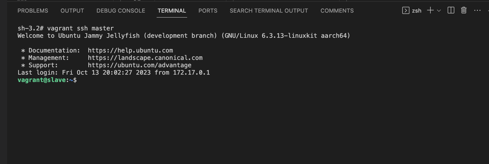
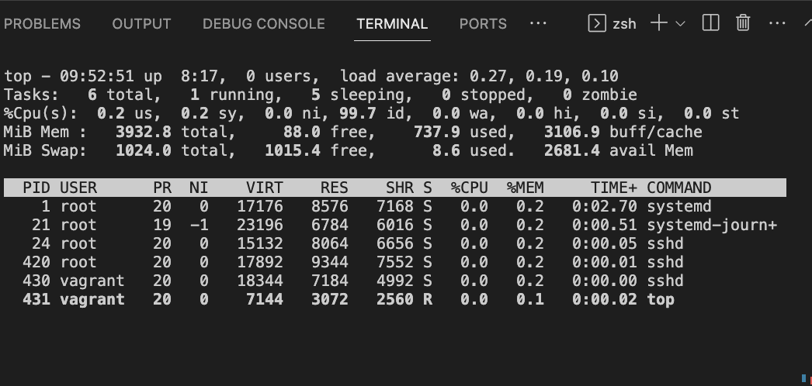
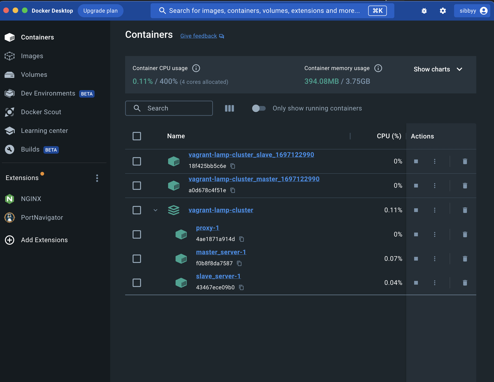

# Deployment of Vagrant Ubuntu Cluster with LAMP Stack With Docker

## Table of Contents

- [Introduction](#introduction)
- [Project Overview](#project-overview)
- [Specifications](#specifications)
- [Prerequisites](#prerequisites)
- [Instructions](#instructions)
- [Documentation](#documentation)
- [Contributing](#contributing)
- [License](#license)

## Introduction

This project provides a bash script to orchestrate the automated deployment of two Vagrant-based Ubuntu systems, designated as 'Master' and 'Slave', with an integrated LAMP (Linux, Apache, MySQL, PHP) stack on both systems.

## Prerequisites

To execute this script, you need the following:

- [Vagrant](https://www.vagrantup.com/downloads.html) installed on your system.
- A Docker image with Vagrant support (included in the script).

## Project Overview

The project automates the deployment and configuration of a two-node Ubuntu cluster, where the Master node acts as a control system, and the Slave node is managed by the Master. It ensures user management, SSH key-based authentication, data transfer, process monitoring, and LAMP stack installation on both nodes.

## Specifications

### Infrastructure Configuration

- Deploy two Ubuntu systems:
  - Master Node: Control system
  - Slave Node: Managed by the Master

### User Management

- On the Master node:
  - Create a user named 'altschool.'
  - Grant 'altschool' user root (superuser) privileges.

### Inter-node Communication

- Enable SSH key-based authentication:
  - The Master node (user 'altschool') can SSH into the Slave node without a password.

  

### Data Management and Transfer

- On initiation:
  - Copy the contents of `/mnt/altschool` directory from the Master node to `/mnt/altschool/slave` on the Slave node using the 'altschool' user from the Master node.

### Process Monitoring

- The Master node displays an overview of Linux process management, showcasing currently running processes.

### LAMP Stack Deployment

- Install a LAMP (Linux, Apache, MySQL, PHP) stack on both nodes:
  - Ensure Apache is running and set to start on boot.
  - Secure the MySQL installation and initialize it with a default user and password.
  - Validate PHP functionality with Apache.
  

## Instructions

1. Clone or download this repository.

2. Ensure you have Vagrant and Docker installed.

3. Run the bash script provided in the project directory. This script will create the Vagrant-based Ubuntu cluster, set up user accounts, enable SSH key-based authentication, transfer data, install the LAMP stack, and configure the system.

The script will guide you through the setup process, and it should automatically deploy the cluster and configure the LAMP stack.
Documentation

For steps and procedures, please refer to the accompanying documentation located in the project folder.

Also you can read a more detailed guide on this and other cloud projects on my blog https://medium.com/@sibylnkaechi

## Contributing

Contributions to this project are welcome. Please follow the standard open-source practices and guidelines for contributing.

## License

This project is licensed under the MIT License.